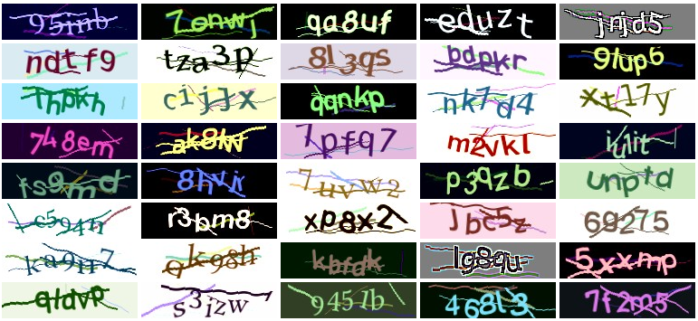

# php-simple-captcha
[](https://codeberg.org/S1SYPHOS/php-simple-captcha/issues)



`php-simple-captcha` creates & verifies captcha images, dependency-free & respecting your user's privacy. It's a fork of [`Gregwar/Captcha`](https://github.com/Gregwar/Captcha), but supports modern PHP versions and comes with several new features & bug fixes.


## Installation

It's available for [Composer](https://getcomposer.org):

```text
composer require s1syphos/php-simple-captcha
```


## Getting started

Upon invoking the main class, you may specify a phrase (the string hidden in the captcha image), otherwise one will be created randomly:

```php
<?php

require_once('vendor/autoload.php');

use SimpleCaptcha\Builder;

# First, you have to instantiate it ..
# (1) .. either this way ..
$builder = new Builder;

# (2) .. or this way
$builder = Builder::create();

# Now, building a captcha is easy
$builder->build();
```

If you want the generated phrase to be *even more random*, `buildPhrase()` has your back:

```php
# Create random phrase ..
# (1) .. consisting of 32 characters
# (2) .. being randomly chosen from 'abc@123'
$phrase = Builder::buildPhrase(32, 'abc@123');

# Now proceed like above ..
# (1) .. either this way ..
$builder = new Builder($phrase);

# (2) .. or this way
$builder = Builder::create($phrase);
```

From here, you can ..

**(1)** .. save the captcha to a file:

```php
$builder->save('out.jpg');

# GIF & PNG are also supported, so this works too:
$builder->save('out.png');
$builder->save('out.gif');

# Optionally, quality may be specified:
# - JPG: 0-100
# - PNG: 0-9
$builder->save('low-quality.jpg', 40);
```

**(2)** .. output it directly in the browser:

```php
# Default: JPG & 90
$builder->output();

# .. but how about ..
$builder->output(6, 'png');
```

**(3)** .. inline its data URI in your HTML:

```php
inline() ?>" />
```

You'll be able to get the code and compare it with a user input:

```php
# Example: storing the phrase in the session to test for the user input later
$_SESSION['phrase'] = $builder->phrase;
```

**Note:** Since one of the randomly selected fonts may contain letters looking very similar, you should validate user input using `compare()`, otherwise you might end up with unsolvable captchas:

```php
if ($builder->compare($input)) {
    # Valid phrase
} else {
    # Invalid phrase
}
```


## Usage

From there, the following functions are available:


### `randomCharacter(string $charset = null): string`

Picks random character (using given charset)


### `buildPhrase(int $length = 5, string $charset = null): string`

Builds random phrase (of given length using given charset)


### `build(int $width = 150, int $height = 40): self`

Builds captcha image


### `buildAgainstOCR(int $width = 150, int $height = 40): self`

Builds captcha image until it is (supposedly) unreadable by OCR software


### `save(string $filename, int $quality = 90): void`

Saves captcha image to file


### `output(int $quality = 90, string $type = 'jpg'): void`

Outputs captcha image directly


### `fetch(int $quality = 90, string $type = 'jpg'): string`

Fetches captcha image contents


### `inline(int $quality = 90, string $type = 'jpg'): string`

Fetches captcha image as data URI


### `compare(string $phrase, string $string = null): bool`

Checks whether captcha was solved correctly. Upon passing another string, both strings are compared (instead of first string & current phrase).


## Configuration

There are several settings you may use in order to change the behavior of the library:


### `$builder->phrase (string)`

Captcha phrase. Default: random, see `buildPhrase()`


### `$builder->fonts (array)`

Paths to captcha fonts. Default: Font files inside `fonts`


### `$builder->distort (bool)`

Whether to distort the image. Default: `true`


### `$builder->interpolate (bool)`

Whether to interpolate the image. Default: `true`


### `$builder->maxLinesBehind (int)`

Maximum number of lines behind the captcha phrase. Default: random


### `$builder->maxLinesFront (int)`

Maximum number of lines in front of the captcha phrase. Default: random


### `$builder->maxAngle (int)`

Maximum character angle. Default: `8`


### `$builder->maxOffset (int)`

Maximum character offset. Default: `5`


### `$builder->bgColor (array|string)`

Background color, either RGB values (array), HEX value or `'transparent'` (string). Default: random


### `$builder->lineColor (array|string)`

Line color RGB values (array) or HEX value (string)


### `$builder->textColor (array|string)`

Text color RGB values (array) or HEX value (string)


### `$builder->bgImage (string)`

Path to background image. Default: background fill, see `bgColor`


### `$builder->applyEffects (bool)`

Whether to apply any effects. Default: `true`


### `$builder->applyNoise (bool)`

Whether to apply background noise (using random letters). Default: `true`


### `$builder->noiseFactor (int)`

Multiples of phrase length to be used for noise generation. Default: `2`


### `$builder->applyPostEffects (bool)`

Whether to apply post effects. Default: `true`


### `$builder->applyScatterEffect (bool)`

Whether to enable scatter effect. Default: `true`


### `$builder->randomizeFonts (bool)`

Whether to use random font for each symbol. Default: `true`


## Examples

Have a look at the examples inside the `demo` folder, which should give you an impression of what's possible - or simply whip up a PHP development server:

```bash
# Change directory
cd demo

# Launch server
php -S localhost:3000

# All examples are now available in your browser, eg 'http://localhost:3000/ocr.php'
```


## Fonts

The `fonts` directory includes:

- [Bitter](https://www.solmatas.com/bitter) (licensed under [OFL](https://scripts.sil.org/OFL))
- [Gidole](https://gidole.github.io) (licensed under [MIT](https://github.com/larsenwork/Gidole/blob/master/Resources/GidoleFont/License.txt))
- [Hack](https://sourcefoundry.org/hack) (licensed under [MIT](https://github.com/source-foundry/Hack/blob/master/LICENSE.md))
- [Linux Libertine](https://libertine-fonts.org) (licensed under [OFL](https://scripts.sil.org/OFL))
- [TGL 0-17](http://www.peter-wiegel.de/TGL_0-16.html) (licensed under [OFL](https://scripts.sil.org/OFL))
- [Vollkorn](http://vollkorn-typeface.com) (licensed under [OFL](https://scripts.sil.org/OFL))


## Credits

This library is based on [`Gregwar/Captcha`](https://github.com/Gregwar/Captcha), introducing several new features & bug fixes.
